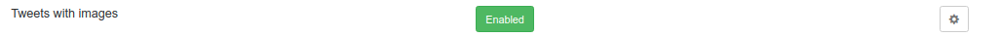

# Feature: tweets with images

- [Feature requisites](#feature-requisites)
- [How feature is implemented](#how-feature-is-implemented)
- [Implementation steps](#implementation-steps)
- [Commits](#commits)

---

## Add new feature toggle disabled

On `Features.java` add new feature toggle:

```
	@Label("Tweets with images")
	TWEETS_WITH_IMAGES
```

It is disabled by default


## Feature toggle control to enable/disable

- **PublisherService.buildPublishTweetRequest(PendingTweet pendingTweet)**: when a tweet is going to be published. Called when a tweet is going to be published using Scheduled task and also when it is published on demand.
- **CreatePendingTweetRequestMapper.mapRequest(final PendingTweetRequest request)**: when a request to create a pending tweet is received
- **PendingTweetResponseMapper.mapResponse(PendingTweet pendingTweet)**: when a pending tweet response is built. Called in the response when a pending tweet is created, when it is searched by ID and when all pending tweets are requested. 
- **TweetResponseMapper.mapResponse(Tweet tweet)**: when a tweet response is built. Called from getTweets and getTweetById

```
{
  "message": "This is a test tweet 14:07 28/11",
  "publicationDate": "2022-04-01T10:00:00Z",
  "images": [
    {
      "url": "https://davidrojo.eu/images/tfm/1.jpg"
    },
    {
      "url": "https://davidrojo.eu/images/tfm/2.jpg"
    }
  ]
}
```

